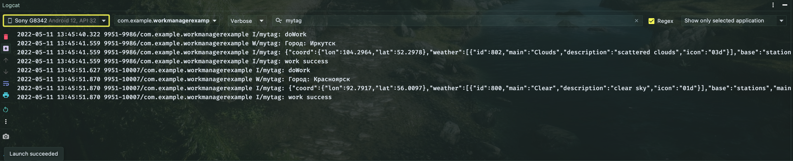

# Использование WorkManager для получения прогноза погоды

Используем хорошо известный [пример с прогнозом погоды](https://github.com/ipetrushin/CurrentWeatherDataBinding) (или любой другой на ваш выбор)

Реализуйте:

- получение прогноза через API OpenWeatherMap
- серию запросов по очереди (например, для нескольких городов) (см. https://developer.android.com/topic/libraries/architecture/workmanager/advanced#chained)

[Заготовка с использованием WorkManager]( https://github.com/ipetrushin/WorkManagerDemo)

## Демонстрация работы

|  |
| ------------------- |

